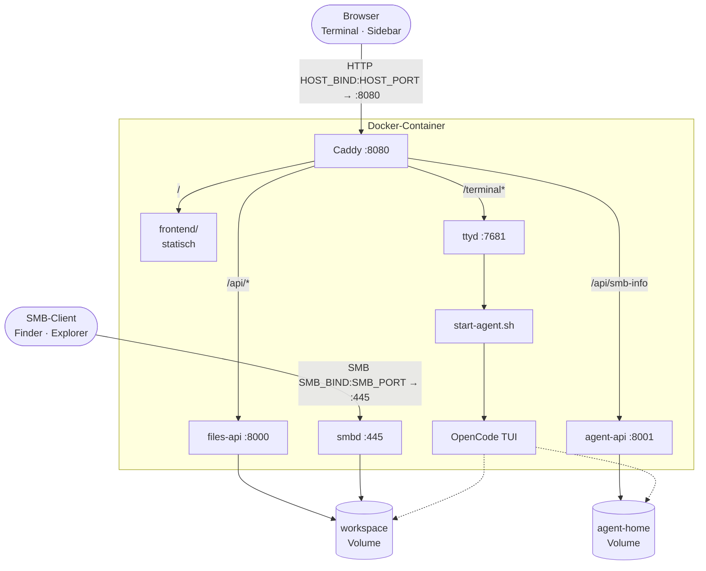

# Komponenten

AgentBox besteht aus einem einzelnen Docker-Container, der eine vollständige, isolierte Agenten-Umgebung kapselt. HTTP läuft gebündelt über Caddy; SMB läuft daneben als eigener Netzlaufwerk-Eingang.

Die Architektur folgt einer einfachen Grenze: Der Browser sieht Terminal und Workspace; der Agent sieht den Workspace und seine Werkzeuge; der Host-Rechner bleibt außerhalb dieser Arbeitsumgebung.

## Datenflussdiagramm



## Komponenten-Tabelle

| Komponente | Tool | Rolle |
|---|---|---|
| Basis | `ubuntu:24.04` | OS |
| Agent | [OpenCode](https://opencode.ai) | TUI-Agent; jede PTY-Verbindung startet eine neue OpenCode-Session über `start-agent.sh` |
| Web-Terminal | [ttyd](https://github.com/tsl0922/ttyd) | PTY → WebSocket → Browser |
| Files-API | Python-Stdlib (`http.server`) | Listing, Upload, Download, Bulk-Operationen, SSE-Watch — kennt strukturell nur `/workspace` |
| Agent-API | Python-Stdlib (`http.server`) | Endpunkte für Agent-State und Geheimnisse (aktuell SMB-Verbindungsinfo); getrennt von der Files-API, weil sie an `/home/agent` herankommen darf |
| SMB-Server | [Samba (`smbd`)](https://www.samba.org) | Workspace als Netzlaufwerk auf TCP/445; Single-User-Modus (`agent`) mit persistiertem Passwort |
| Frontend | Statisches HTML/CSS/JS, ES-Module | Tab-Shell, ruft Files-API direkt auf |
| Reverse Proxy | [Caddy](https://caddyserver.com) | Single-Port-Routing für HTTP, statisches Ausliefern |
| Persistenz | Docker-Volumes | `workspace` → `/workspace` (Anwenderdateien), `agent-home` → `/home/agent` (Agent-State, Auth, Sessions, SMB-Passdb) |

Default-Konfigurationen, Skills und Agenten können im Image zentral vorbereitet werden. Die persönlichen Arbeitsdateien liegen dagegen im jeweiligen Workspace-Volume der Instanz.

## Eingangspunkte

AgentBox veröffentlicht **zwei** Container-Ports nach außen:

| Port (Container) | Mapping (Default) | Protokoll | Zweck |
|---|---|---|---|
| `:8080` | `${HOST_BIND:-127.0.0.1}:${HOST_PORT:-80}` | HTTP | Web-UI (Caddy) |
| `:445` | `${SMB_BIND:-0.0.0.0}:${SMB_PORT:-445}` | SMB | Netzlaufwerk (smbd) |

Asymmetrie ist gewollt: Web-UI defaultet auf Loopback (Reverse-Proxy-Empfehlung), SMB defaultet auf alle Interfaces — sonst wäre ein Mount aus dem LAN nicht möglich. Der Container läuft unprivilegiert und erhält nur `CAP_NET_BIND_SERVICE`, damit smbd Port 445 binden kann.

### HTTP-Routing

Caddy lauscht im Container auf `:8080`. Vier Routing-Regeln in der `Caddyfile`:

| Pfad | Ziel | Bemerkung |
|---|---|---|
| `/api/events` | `127.0.0.1:8000` | SSE-Stream, **kein** gzip, `flush_interval -1` |
| `/api/smb-info` | `127.0.0.1:8001` | Agent-API (SMB-Verbindungsdaten) |
| `/api/*` | `127.0.0.1:8000` | Files-API |
| `/terminal/*` | `127.0.0.1:7681` | ttyd-WebSocket |
| `/` | `/srv` static | Frontend (HTML, CSS, JS, Sprite, Logo) |

Der SSE-Stream **muss** in einem eigenen `handle`-Block stehen — sonst hält Caddy ihn beim gzip-Encode an.

## Warum eine eigene Files-API?

Bewusst **kein** fertiges Filebrowser-Tool: gängige Lösungen (`filebrowser`, `dufs` etc.) bringen Tree-View, Editor, Sharing oder Move/Copy mit, die nicht gewünscht sind und nicht restlos ausblendbar. Die Operationen, die wir wirklich brauchen, sind als eigener Endpunkt schlanker als jedes Drittanbieter-Tool zu verbiegen — und vor allem: er kennt nur `/workspace`, nicht das Container-`HOME`. Damit bleibt die Sidebar die klare Übergabestelle für Anwenderdateien.

Details zu den Endpunkten: [Files-API](files-api.md).

## Prozess-Lifecycle

`entrypoint.sh` startet fünf Prozesse parallel und wartet auf den ersten, der endet:

```
files-api  (Python, :8000)
   +
agent-api  (Python, :8001)
   +
smbd       (:445)
   +
ttyd       (:7681, ruft start-agent.sh als PTY-Kommando)
   +
caddy      (:8080)
```

Stirbt einer, beendet der trap die anderen — der Container endet, Compose startet ihn neu (`restart: unless-stopped`).

Bevor die Dienste starten, initialisiert `entrypoint.sh` den SMB-State im `agent-home`-Volume: er legt die Samba-Datendirs an, liest ein vorhandenes Passwort oder generiert ein neues, übernimmt optional `$SMB_PASSWORD`, schreibt den Wert in die `tdbsam`-Passdb und legt eine Klartext-Kopie unter `/home/agent/.config/agentbox/smb-passwd` ab — die Web-UI liest darüber das Passwort fürs Verbindungsmodal.
